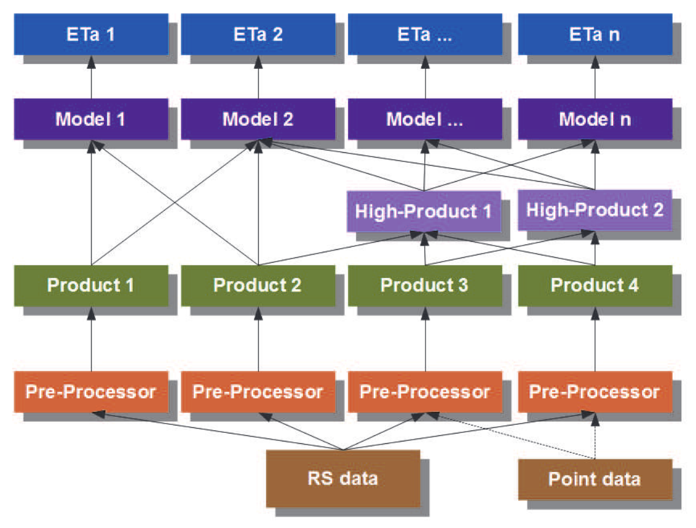
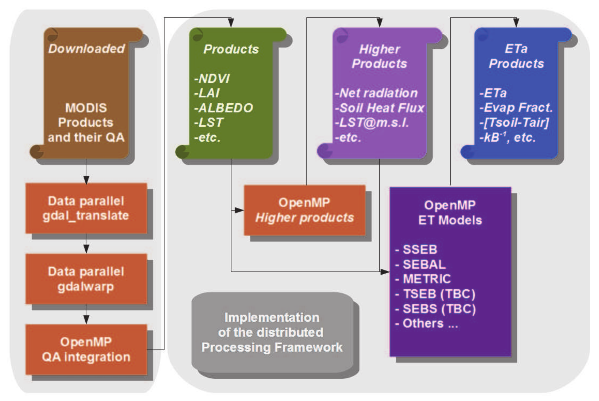
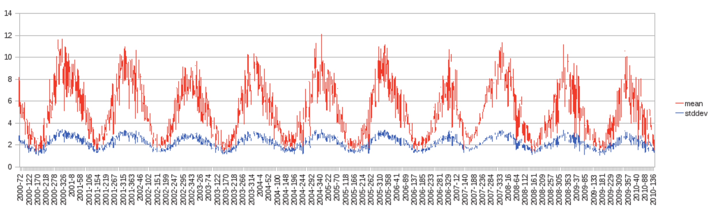
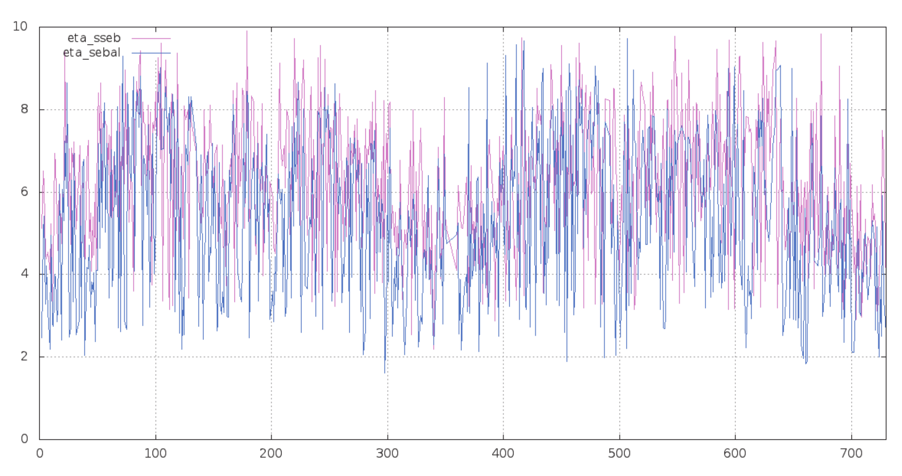

# distRS 

A distributed computing framework for MODIS satellite imagery high-level products processing

# Description[^1]

With the various types of actual ET models being developed in the last 20 years, it becomes
necessary to inter-compare methods. Most of already published ETa models comparisons
address few number of models, and small to medium areas (Chemin et al., 2010; Gao & Long,
2008; García et al., 2007; Suleiman et al., 2008; Timmermans et al., 2007). With the large amount
of remote sensing data covering the Earth, and the daily information available for the past ten
years (i.e. Aqua/Terra-MODIS) for each pixel location, it becomes paramount to have a more
complete comparison, in space and time.

To address this new experimental requirement, a distributed computing framework was
designed, and created. The design architecture was built from original satellite datasets
to various levels of processing until reaching the requirement of various ETa models input
dataset. Each input product is computed once and reused in all ETa models requiring such
input. This permits standardization of inputs as much as possible to zero-in variations of
models to the models internals/specificities.

Practically, MODIS datasets are grouped by products and by day and batch processed
each in one core of the computer in parallel. This involves format changing, merging tiles,
reprojecting, renaming outputs according to the nomenclature of the processing system. The
tools involved in that step are either standard Linux Shell tools, either part of GDAL (2011)
standard tools (i.e. gdalwarp and gdal_translate). Both of these tools are still essentially
sequential programs at this time, thus, they are being sent to each core in a distributed
manner through the Shell with a check loop to ensure that there is at all time the same
number of programs running as there are cores/threads available in the CPU architecture.
It becomes clear that for each new leap in number of cores in future commercial offerings, the
framework will automatically increase its processing capacity to the new enlarged number of
cores/threads available, thus also reducing by the same factor the time needed to process a
given number of satellite images.

Models that are already inside the framework account to SSEB from Senay et al. (2007),
METRIC from Allen et al. (2007), SEBAL from Bastiaanssen et al. (1998) using the work from
Alexandridis et al. (2009), in progress are SEBS from Su (2002) and TSEB from both Kustas &
Norman (1999) and Norman et al. (1995).

Reference ET models included are Allen et al. (1998) from Cannata (2006), Priestley and Taylor
(Priestley & Taylor, 1972) and Hargreaves (Hargreaves et al., 1985), Modified Hargreaves
(Droogers & Allen, 2002), Hargreaves-Samani (Hargreaves & Samani, 1985). Only the
reference ET from Allen et al. (1998) is being used as a precursor of SSEB (Senay et al., 2007)
and METRIC (Allen et al., 2007) actual ET. It was found preponderant to have a minimum
group of reference ET models available as baseline for all the work, especially when looking
into geographical areas where meteorological data has always been dominant in agricultural
literature.

Some models requiring operator intervention (SEBAL, METRIC) have add there internals
modified with specially designed heuristics acting as operators. Initial developments were not
looking into heuristics but stochastic algorithms. Some efforts using a genetic algorithm were
eventually too expensive in processing time, while at the same time end-member selection
information were becoming more common (Chandrapala & Wimalasuriya, 2003; Timmermans
et al., 2007). Thus heuristics were designed and implemented on a regional basis, initially
studied under the Greek conditions for the purpose of Alexandridis et al. (2009) and Chemin
et al. (2010). Eventually, the heuristics are extended to fit data sources, continent/climate
combinations and model types on an adhoc basis as new regions are included into the
geographical scope of research.

In the case of SEBAL heuristic, the convergence reached 82% of the images processed for
the Australian Murray-Darling Basin (1 Million Km2 ), enabling the automatic processing
of 3635 MODIS multi-tiles images within a single day of computing. Fig. 3 is the output
from SEBAL with such heuristic for some irrigated areas in Australia, the total area being
processed amounts to more than 5 Billions pixels of ETa values, being multiplied by as many
temporary rasters and original data as required for each of the ET models. The Australian
irrigation system (less than 100,000 ha) has a sharp, contrasted and well-defined pattern of
water depletion, characteristic of continental dry climate with high water supply control for
defined periods of the year where crops are in the field.

Daily RS-based ETa (mm/day) in an Australian irrigation system (2000-2010)

Looking into the matter of comparing ETa results from different ETa models, Fig. 4 is the
averaged ETa output from two models (SEBAL and SSEB) over the tropical island of Sri Lanka
in 2003 and 2004. It turns out that the relatively small island of Sri Lanka has an average ETa
that is changing much more on a day to day basis than our previous example in Australia.
Scale, climate, topography yield exposure to ocean events frequently, having drastic impact
on thermodynamics of the island surface as the Fig. 5 also confirms. Changes between models
of actual ET from SEBAL and SSEB are relatively constant throughout the RS modeling period.
Actual ET from SSEB is in the upper range of SEBAL’s one. The work of de Silva (1999) in the
dry zone of Sri Lanka and the work of Hemakumara et al. (2003) in the wet zone of Sri Lanka
are falling within the expected results found here. Likewise the average evaporative fractions
found for Sri Lanka are especially leveraging the larger dry zone area of the island
with value in the range of 0.3 to 0.5.

Daily ETa (mm/day) averages for Sri Lanka (2003-2004)

Challenges to experimentally compare ET models are immense, the theoretical points of
comparison are sometimes clear, sometimes rather difficult to pinpoint. To try and address
this situation, a framework for benchmarking ET actual models has been designed. Its
implementation has embedded parallel data distribution at the base of each parts of the
framework to remove the resistance of the data size to process large areas, high frequency
and large time period with commonly available computers.

Future work includes the finalization of SEBS (Su, 2002) and TSEB (Kustas & Norman, 1999)
integration in the framework, looking for other ETa model candidates to add to existing ones.
Also there is a need for designing and creating statistical tools to cross-compare several depths
and layers of ETa models processing datasets. Finally, the use of OpenMPI (OpenMPI, 2011)
is envisaged for concurrently running several ET models diagnostics in different multi-core
machines or OpenCL (Khronos.org, 2011) kernel-based data distributed language to process
all analysis as one large computation on a Graphical Processing Unit (GPU).

[^1]: http://www.intechopen.com/books/evapotranspiration-remote-sensing-and-modeling/a-distributed-benchmarking-framework-for-actual-et-models

